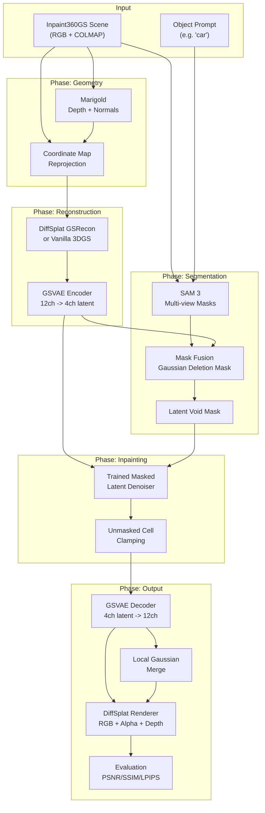

# Complete the Latent Void Project

## Current State Summary

The project has substantial infrastructure already built:

- **Pipeline scaffolding**: Full end-to-end orchestration from dataset discovery through geometry (Marigold), reconstruction (DiffSplat GSRecon/GSVAE), segmentation (SAM 3), mask fusion, void creation, latent inpainting, and rendering.
- **Zaratan integration**: Setup scripts, checkpoint downloads, dependency installation, `srun` stage helpers, DiffSplat compatibility shims.
- **Verified runs**: H100 MVP on the `bag` scene, multi-scene geometry/segmentation for 11 Inpaint360GS scenes, GObjaverse sanity check confirming DiffSplat health.
- **Training scaffolds**: Reconstruction adapter (10k steps, 11 scenes, loss 0.33 -> 0.04), masked latent denoiser (20k steps, loss 1.94 -> 0.0004), GSRecon fine-tuning experiments.
- **Visual baseline**: `car` scene with vanilla 3DGS at 30k iterations -- source renders, 2D mask void visualization, official object-free targets.

**Key blockers identified by the project**:

1. DiffSplat GSRecon/GSVAE produces poor renders on real scenes (domain mismatch from GObjaverse training).
2. No research-quality learned latent denoiser yet (only context-fill baseline and smoke trainers).
3. No final end-to-end inpainted 3D scene renders that can be evaluated.

## Hardware Available

- H100 GPU with 12 cores of 8 GB each (80 GB total VRAM) -- sufficient for full DiffSplat fine-tuning, GSVAE training, and multi-view rendering. (tmux session 0)
- A100 GPU with 10 cores of 8 GB each (40 GB total VRAM) -- which you can use parallely when H100 is being used. (tmux session 1)

## Phased Plan

### Phase 0: Environment Validation and Quick Wins (Day 1)

Verify the current environment is ready before launching GPU work.

- Validate all configs and run unit tests: `python3 -m unittest discover -s tests`
- Validate strict-paths on the Zaratan config
- Confirm checkpoints exist: `diffsplat/gsrecon_gobj265k_cnp_even4`, `gsvae_gobj265k_sdxl_fp16`, SAM 3, Marigold, auxiliary VAEs
- Confirm the 11-scene patch dataset at `runs/scene_patch_training_long/multiscene_patch_dataset/scene_patch_dataset.json`
- Confirm the existing trained artifacts: recon adapter checkpoint, masked latent denoiser checkpoint

### Phase 1: Improve Real-Scene Reconstruction (Days 1-3)

**This is the critical blocker.** DiffSplat's GSRecon was trained on GObjaverse objects, not real scenes. The teacher render diagnostics confirmed the camera/coordinate contract is the issue, not just training duration.

**Strategy A: Full GSRecon fine-tuning on multi-scene patches (primary path)**

The existing `tools/finetune_gsrecon_scene_patches.py` already supports training all GSRecon parameters. The A100 experiments showed partial improvement but structural failures persisted. With H100 and more training:

1. Run full-parameter GSRecon fine-tuning on the 11-scene patch dataset for 5000-10000 steps with research losses (foreground L1, DSSIM, alpha BCE/Dice, depth L1).
2. Use fixed validation every 200 steps with visual sheets.
3. Evaluate render quality: if the direct GS grid renders are recognizable objects, proceed. If not, try Strategy B.

**Strategy B: Vanilla 3DGS reconstruction + DiffSplat latent encoding (fallback)**

The `car` visual baseline proves vanilla 3DGS produces excellent scene reconstruction at 30k iterations. An alternative approach:

1. Train vanilla 3DGS per-scene (already proven for `car`).
2. Use the trained 3DGS Gaussians as the scene representation.
3. Encode the 3DGS Gaussian grid through GSVAE into latent space (the GSVAE encoder path).
4. Perform latent void + inpainting in that latent space.
5. Decode back through GSVAE and render.

This bypasses GSRecon entirely for the source reconstruction while still using the GSVAE latent space for inpainting. The key code path is:

- [tools/render_latent_scene.py](tools/render_latent_scene.py) already handles GSVAE decode + render.
- The GSVAE encoder needs to be applied to 3DGS-fitted Gaussian grids.
- A bridge tool is needed to convert vanilla 3DGS output into DiffSplat's structured 12-channel grid format.

**Strategy C: Direct 3DGS pruning + per-view inpainting baseline (diagnostic only)**

The projection-based pruning left artifacts, but Inpaint360GS-style multi-view inpainting on vanilla 3DGS could serve as a comparison baseline (not the main method per D005).

### Phase 2: Train the Masked Latent Denoiser (Days 2-5)

Once reconstruction produces readable renders, train the real inpainting model.

**Step 2a: Generate larger training dataset**

Using the multi-scene data already generated:

- Generate 4096+ synthetic-mask samples from the 11-scene latent patches using [tools/generate_native_latent_training_data.py](tools/generate_native_latent_training_data.py).
- Include mixed mask modes: random rectangles, projected SAM components, depth ellipsoids.
- Split by scene for train/val.

**Step 2b: Train the masked latent denoiser**

Using [tools/train_masked_latent_denoiser.py](tools/train_masked_latent_denoiser.py):

- Initialize from the existing 20k-step checkpoint at `runs/scene_patch_training_long/masked_latent_denoiser_20k/`.
- Train for 50000+ steps with batch size 8-16 on the larger dataset.
- Add held-out render consistency loss (decode through GSVAE, render, compare to target views).
- Enforce hard unmasked-cell clamping: `z = z_pred * m + z_context * (1 - m)`.
- Save checkpoints every 5000 steps.
- Generate visual eval sheets at validation intervals.

**Step 2c: Evaluate denoiser quality**

Using `runs/scene_patch_training_long/native_latent_eval_256/` or generating new eval samples:

- Compute masked MSE, context error, and held-out view PSNR/SSIM.
- Generate visual sheets showing source / masked / predicted / error.
- If masked MSE < 0.001 and context error = 0.0, proceed to end-to-end integration.

### Phase 3: End-to-End 3D Object Removal (Days 4-6)

Integrate the trained denoiser into the full pipeline.

**Step 3a: Wire the trained denoiser into the inpaint stage**

- Update [tools/inpaint_latent_context.py](tools/inpaint_latent_context.py) or create a new `tools/inpaint_latent_denoiser.py` that loads the trained checkpoint and runs denoising inference.
- Update [configs/zaratan_inpaint360gs_bag.yaml](configs/zaratan_inpaint360gs_bag.yaml) to point `external.inpaint_command` at the new denoiser.
- The denoiser should accept: source latent, void mask, and output the inpainted latent.

**Step 3b: Run end-to-end on multiple scenes**

For each of the primary Inpaint360GS scenes (`bag`, `car`, `cube`, `garden_toys`, `truck`, `fruits`):

1. Geometry preprocessing (already done for 11 scenes)
2. GSRecon/GSVAE export (or vanilla 3DGS + GSVAE encode per Strategy B)
3. SAM 3 segmentation (already done for 11 scenes)
4. Mask fusion + void creation
5. Learned latent denoiser inpainting
6. GSVAE decode + render before/after/void comparison sheets

**Step 3c: Local Gaussian merge**

Using [tools/merge_local_inpaint.py](tools/merge_local_inpaint.py):

- Merge decoded local inpainted Gaussians back into the full scene.
- Apply visibility/opacity filtering.
- Render the composite scene from novel viewpoints.

### Phase 4: Visual Baseline Completion (Days 3-5, parallel with Phase 2)

Extend the `car` visual baseline to more scenes for the final presentation.

For each target scene:

1. Train vanilla 3DGS for 30k iterations (using Inpaint360GS data).
2. Run SAM 3 on source views to generate object masks.
3. Render source views, 2D-masked void views, and official object-free target views.
4. Generate comparison sheets like `render_void_target_comparison.png`.
5. Record `final_baseline_status.json`.

Target scenes: `car` (done), `bag`, `cube`, `cone_red`, `garden_toys`, `truck`.

### Phase 5: Quantitative Evaluation (Days 5-7)

Implement evaluation metrics for the final paper/presentation.

- **PSNR/SSIM/LPIPS**: Compare inpainted renders to official object-free target frames from Inpaint360GS.
- **Multi-view consistency**: Measure variance of inpainted regions across views.
- **Mask coverage statistics**: Log deletion counts, void sizes, latent cell counts.
- **Before/after/target comparison grids**: Side-by-side per-scene.
- **Create an evaluation script** in `tools/` that computes all metrics and writes a summary JSON + visual report.

### Phase 6: Documentation and Final Artifacts (Day 7)

- Update `project_memory/STATUS.md` with final results.
- Update `summary.md` with quantitative results.
- Generate a final presentation artifact with:
  - Per-scene comparison grids (source | void | inpainted | target)
  - Metric tables
  - Architecture diagram
  - Training curves
- Ensure all code is committed and `README.md` is updated.

## Architecture Flow

## Key Files to Modify/Create

- **Modify**: [tools/train_masked_latent_denoiser.py](tools/train_masked_latent_denoiser.py) -- add render consistency loss, larger training support
- **Modify**: [tools/finetune_gsrecon_scene_patches.py](tools/finetune_gsrecon_scene_patches.py) -- full H100 training run
- **Create**: `tools/evaluate_inpaint_quality.py` -- PSNR/SSIM/LPIPS evaluation
- **Create**: `tools/convert_3dgs_to_diffsplat_grid.py` -- bridge vanilla 3DGS to GSVAE (if Strategy B)
- **Modify**: [configs/zaratan_inpaint360gs_bag.yaml](configs/zaratan_inpaint360gs_bag.yaml) -- point to trained denoiser
- **Modify**: [project_memory/STATUS.md](project_memory/STATUS.md) -- update after each phase

## Risk Mitigation

- **If GSRecon fine-tuning still fails**: Fall back to Strategy B (vanilla 3DGS + GSVAE encode). The `car` baseline proves 3DGS works beautifully.
- **If masked latent denoiser doesn't converge**: The 20k-step denoiser already achieves 0.0004 MSE on synthetic masks; scaling up should work. If not, fall back to the context-fill baseline with better mask quality controls.
- **If GSVAE encode/decode is lossy**: The GObjaverse sanity check shows GSVAE works on in-domain data. For real scenes, accept some degradation and report it as a finding.
- **Time pressure**: Phases 1-3 are the critical path. Phase 4 (visual baselines) can run in parallel. Phase 5 (evaluation) can use whatever inpainting quality is available.

